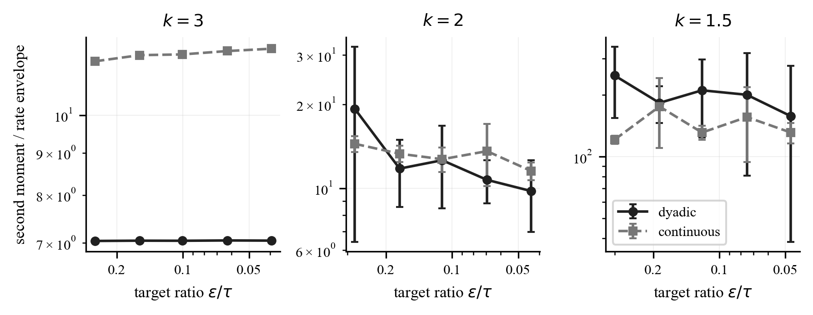
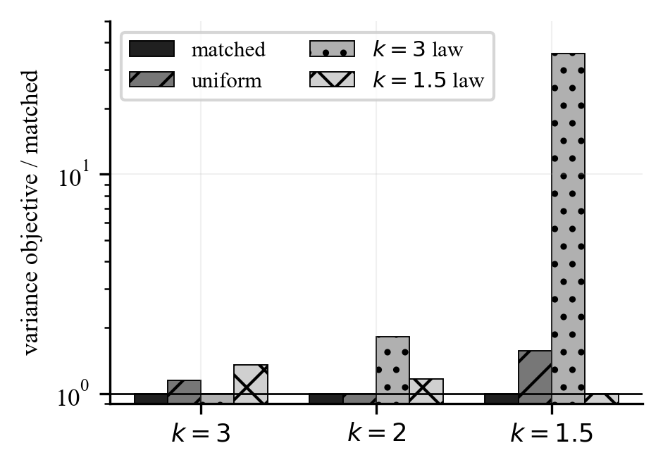

# onebitmean

Reference implementations and reproducible numerical checks for fully
non-adaptive one-bit mean estimation under finite-moment assumptions.

This repository accompanies the manuscript
*Interaction Is Unnecessary for Order-Optimal One-Bit Mean Estimation with
General Queries*. It implements both refinement constructions in the paper
behind one frozen-query interface: every one-bit query is fixed before any
message is observed, while the decoder may reinterpret the stored bits after
a coarse localization center becomes available.

## What is implemented

| Component | Role |
| --- | --- |
| `DyadicPlan` | Main construction: safe periodic residues, adjacent-scale telescoping, and moment-matched scale allocation. |
| `ContinuousPlan` | Alternative appendix construction: randomly shifted grids with pairwise-independent Rademacher cell colors. |
| `LocalizationPlan` | Coding-based coarse localization shared by both refinement backends. |
| `CompiledRefinement` | Common compile/encode/decode interface with immutable plans and SHA-256 fingerprints. |

Both backends consume exactly one Boolean message per observation. They share
the same public API but expose different proof-to-code tradeoffs: the dyadic
backend mirrors the main theorem and stores less public plan data per query;
the continuous backend is compact conceptually and serves as an independent
check that the result is not an artifact of the dyadic telescope.

## Statistical guarantee

For distributions satisfying

$$
|\mathbb E X|\leq\lambda,
\qquad
\mathbb E|X-\mathbb E X|^k\leq\sigma^k,
\qquad k>1,
$$

the accompanying analysis gives the following refinement costs for estimating
the mean to accuracy $\varepsilon$ with failure probability at most $\delta$.
The three moment regimes have distinct rates:

**Finite-variance regime ($k>2$)**

$$
O_k\!\left(
  \left(\frac{\sigma}{\varepsilon}\right)^2
  \log\frac{1}{\delta}
\right).
$$

**Critical regime ($k=2$)**

$$
O\!\left(
  \left(\frac{\sigma}{\varepsilon}\right)^2
  \left[1+\log\left(\frac{\sigma}{\varepsilon}\right)\right]
  \log\frac{1}{\delta}
\right).
$$

**Heavy-tail regime ($1<k<2$)**

$$
O_k\!\left(
  \left(\frac{\sigma}{\varepsilon}\right)^{\frac{k}{k-1}}
  \log\frac{1}{\delta}
\right).
$$

Coarse localization contributes an additive
$O_k(1+\log(\lambda/\sigma)+\log(1/\delta))$ term. The protocols assume that
$k$, $\sigma$, the target accuracy, and the confidence level are known when
the public query plan is compiled.

## Installation

Python 3.10 or newer is required.

```bash
python -m pip install -e ".[experiments,test]"
```

The core package depends only on NumPy. SciPy and Matplotlib are optional and
used by the validation scripts.

## Quick start

```python
import numpy as np
from onebitmean import compile_refinement

compiled = compile_refinement(
    backend="dyadic",
    k=2.0,
    sigma=1.0,
    epsilon=0.1,
    tau=1.5,
    refinement_samples=20_000,
    seed=7,
)

# In the protocol, these are disjoint fresh sample blocks.
rng = np.random.default_rng(8)
samples = {
    name: 0.2 + rng.standard_normal(count)
    for name, count in compiled.query_counts.items()
}

bits = compiled.encode(samples)  # one Boolean per observation
center = 0.0                     # normally returned by localization
estimate = compiled.decode(bits, center=center, blocks=40)

print(estimate)
print(compiled.plan_fingerprint)
```

Set `backend="continuous"` to use the alternative construction without
changing the external protocol. The caller is responsible for using fresh,
independent sample blocks and for supplying a localization center satisfying
the event assumed in the paper.

## Reproducing the numerical checks

```bash
pytest -q
python experiments/run_validation.py --profile full
python experiments/plot_results.py
```

The validation run records machine-readable CSV and JSON files in `results/`
and regenerates the figures in `figures/`. Its random seed schedule is explicit
and deterministic.

### Rate validation

The experiment checks all three moment regimes for both implementations. The
lines are the predicted moment envelopes; points and uncertainty bars are
Monte Carlo estimates.



### Scale-allocation ablation

The ablation compares the theorem-matched distribution over scales with
uniform, light-tail, and heavy-tail alternatives.



In the committed full-profile run, the largest absolute bias was below
$0.060\varepsilon$, and the largest implementation cross-check discrepancy was
$1.98$ standard errors. These values summarize this deterministic numerical
audit; they are not substitutes for the paper's uniform mathematical
guarantees.

## Repository layout

```text
src/onebitmean/   Protocol implementations
experiments/      Deterministic validation and plotting scripts
results/          Raw CSV/JSON output from the full validation run
figures/          PDF figures and PNG previews
tests/            Unit and statistical regression tests
```

## Scope and finite-precision note

The theory permits ideal public real-valued randomness and arbitrary measurable
queries on unbounded real inputs. This implementation uses NumPy floating-point
uniforms. For signed 64-bit cell indices, the continuous backend realizes the
required pairwise-independent Rademacher coloring with a 65-bit affine parity
family. The repository does not claim a finite-precision extension of the
theorem beyond these documented numerical checks.

The localization implementation uses a conservative code-length coefficient
of `10000`. The `certified` profile retains this value and verifies the required
balanced-distance property; the `research` profile is intended for tests and
small simulations and is not a theorem-certified replacement.

## Citation

```bibtex
@misc{miao2026interaction,
  title  = {Interaction Is Unnecessary for Order-Optimal One-Bit Mean
            Estimation with General Queries},
  author = {Miao, Yuchen},
  year   = {2026},
  note   = {Preprint}
}
```

Machine-readable citation metadata is available in [`CITATION.cff`](CITATION.cff).

## License

Released under the [MIT License](LICENSE).
